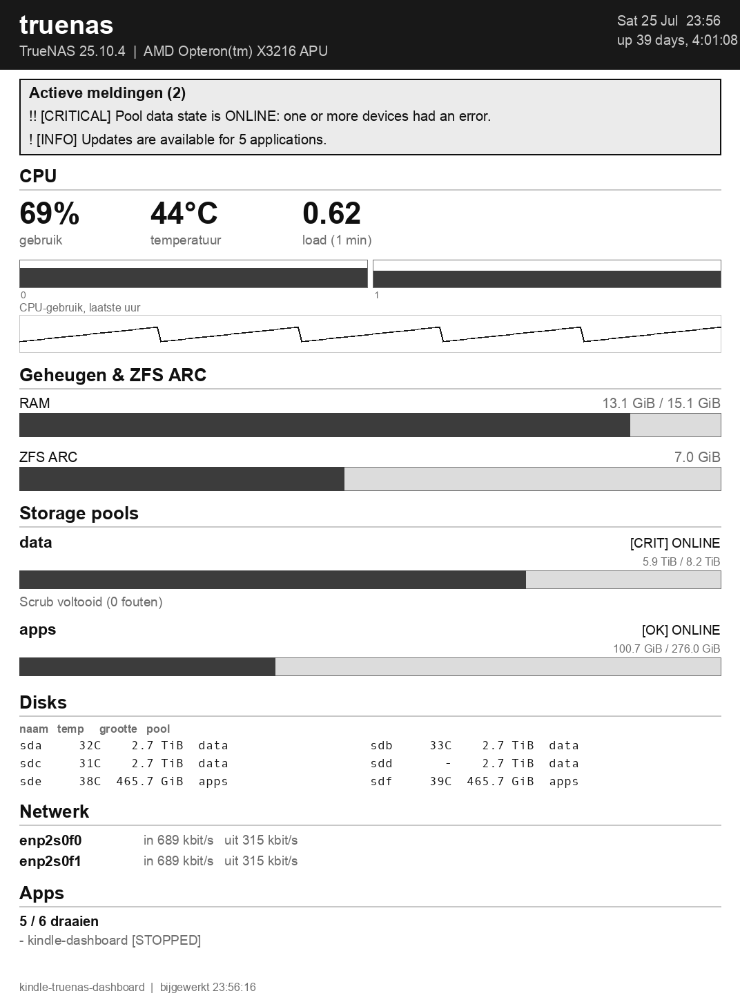

# kindle-truenas-dashboard

Een statusdashboard van een TrueNAS SCALE-server (CPU, geheugen/ZFS ARC,
disks, pool-status/scrub, netwerk, apps, actieve meldingen), gerenderd als
PNG en getoond op een jailbroken Kindle Voyage als vervangende screensaver.

[](https://github.com/arjankapteijn/kindle-truenas-dashboard/actions/workflows/ci.yml)
[](https://github.com/arjankapteijn/kindle-truenas-dashboard/actions/workflows/docker-publish.yml)
[](https://github.com/arjankapteijn/kindle-truenas-dashboard/tags)


---

## Voorbeeld



<sub>Voorbeeldweergave (1072×1448, grijswaarden — zoals op het echte
e-inktscherm), gerenderd met verzonnen data via <code>scripts/render_preview.py</code>.</sub>

## Hoe werkt het?

```
┌─────────────────────┐  websocket   ┌──────────────────────────┐   HTTP GET   ┌────────────┐
│   TrueNAS SCALE      │◄────JSON-RPC─┤ deze app (TrueNAS custom │◄─────────────┤   Kindle    │
│   (25.10 "Goldeye")  │              │ app, self-scheduling)    │  elke 5 min  │   Voyage    │
└─────────────────────┘              │ schrijft dashboard.png   │              │ (linkss     │
                                      │ naar /data + serveert    │              │ screensaver)│
                                      │ 't over :8000            │              └────────────┘
                                      └──────────────────────────┘
```

Anders dan [lovebox](https://github.com/arjankapteijn/lovebox) (dat dagelijks
een afbeelding *pusht* naar een extern apparaat) is dit een **pull-model**:
de container ververst zelf periodiek en houdt de laatste PNG klaar op een
vast HTTP-endpoint; de Kindle haalt 'm zelf op wanneer het uitkomt.

## Wat het dashboard toont

CPU (gebruik totaal + per core, temperatuur, load average, uur-sparkline),
geheugen- en ZFS ARC-gebruik, storage pools (status, scrub/resilver,
gebruikte/vrije ruimte), disks (temperatuur, grootte, pool), netwerk
(doorvoer per interface), apps (draaiend/gestopt) en actieve TrueNAS-alerts
(SMART- en pool-waarschuwingen komen hier binnen, niet als los
"SMART-status"-veld). Secties met een variabele hoeveelheid content (disks,
apps, netwerk, pools) zijn begrensd op de beschikbare ruimte op het
1072×1448-scherm: bij te veel content wordt "+N meer" getoond, of wordt een
hele sectie overgeslagen (met een vermelding in de voettekst) in plaats van
tekst te laten overlappen.

---

## Snelstart

1. **API-key aanmaken** in de TrueNAS-UI: gebruikersmenu (rechtsboven) →
   *My API Keys* → *Add API Key*. Overweeg een aparte, minder bevoorrechte
   gebruiker specifiek voor deze key (een API-key erft de rol van de
   gekoppelde gebruiker — er is geen aparte read-only scoping in de UI).
2. Kopieer `.env.example` naar `.env` en vul `KD_TRUENAS_URL` en
   `KD_TRUENAS_API_KEY` in (zie `.env.example` voor uitleg per variabele).
3. **Deploy als TrueNAS custom app** — zie [Deployen op TrueNAS](#deployen-op-truenas-custom-app) hieronder.
4. Zet de Kindle-kant op — zie [`kindle/README.md`](kindle/README.md) voor
   de volledige installatie (linkss-screensaver, KUAL-scriptlet, fbink).

## Lokaal ontwikkelen

```bash
python3 -m venv .venv && source .venv/bin/activate
pip install -e ".[dev]"
ruff check . && ruff format --check . && pytest

# Layout visueel checken zonder TrueNAS-verbinding (schrijft docs/screenshot.png-achtige preview):
python scripts/render_preview.py preview.png

# Eén keer live tegen je TrueNAS-server renderen (i.p.v. de scheduler+server):
KD_TRUENAS_URL=wss://172.16.0.1:8443/api/current \
KD_TRUENAS_VERIFY_SSL=false \
KD_TRUENAS_API_KEY=1-... \
KD_RUN_ONCE=true KD_DATA_DIR=/tmp \
  python -m kindle_dashboard.main
```

---

## Deployen op TrueNAS (custom app)

**1. Zorg dat de ghcr-package public is** (of geef TrueNAS een pull-credential),
anders kan `pull_policy: always` het image niet ophalen.

**2. Zet je `.env` op een vast pad**, bijv. `/mnt/apps/kindle-dashboard/.env`
(zie [Snelstart](#snelstart) voor de inhoud). Gebruik een **absoluut pad** —
TrueNAS herschrijft een relatief `env_file`-pad naar `/tmp/.env`, en dat
faalt dan stil.

**3. Apps → Discover Apps → ⋮ → Install via YAML**, naam `kindle-dashboard`,
en plak de inhoud van [`docker-compose.yml`](docker-compose.yml).

**4. Start**, en controleer daarna:

```bash
curl http://<truenas-ip>:8000/healthz   # -> ok
curl -o test.png http://<truenas-ip>:8000/dashboard.png
```

De container draait als non-root, met read-only rootfs, `cap_drop: ALL`,
`no-new-privileges` en een healthcheck op een heartbeat-bestand in `/data`.

> **Twee valkuilen (zelfde als bij lovebox):**
> - Gebruik een **absoluut** `env_file`-pad. Een relatief `.env` wordt door
>   TrueNAS naar `/tmp/.env` herleid en niet gevonden.
> - Gebruik een **named volume** voor `/data`, geen `tmpfs`. Een tmpfs is niet
>   schrijfbaar voor de non-root app-user, waardoor het heartbeat-bestand niet
>   geschreven wordt, de healthcheck faalt en de app op *"deploying"* blijft
>   hangen.

### Een eigen icoon in de Apps-lijst

TrueNAS custom apps hebben geen icoon-veld in de YAML; de zichtbaarheid komt
uit de app-metadata. Zet het icoon in het **per-app**-bestand
`/mnt/.ix-apps/app_configs/kindle-dashboard/metadata.yaml` — als sleutel
onder het `metadata:`-blok. **Niet** in het globale `/mnt/.ix-apps/metadata.yaml`:
dat wordt bij elke deploy opnieuw opgebouwd, waardoor je icon-regel wordt gewist.
Het per-app-bestand blijft wél staan over updates heen.

Als root op TrueNAS:

```bash
sed -i '/^"metadata":/a\  "icon": "https://raw.githubusercontent.com/arjankapteijn/kindle-truenas-dashboard/main/docs/icon.png"' \
  /mnt/.ix-apps/app_configs/kindle-dashboard/metadata.yaml
```

Een edit op schijf pakt TrueNAS pas op na een redeploy: ga in de UI naar
Apps → **kindle-dashboard** → **Edit** → **Save** (zonder wijzigingen).
Daarna eventueel een harde browser-refresh (Ctrl/Cmd+Shift+R) tegen de
icoon-cache.

### Updaten

`:latest` + `pull_policy: always`: app opnieuw deployen → nieuwste image. Voor
reproduceerbaarheid kun je een vaste tag pinnen (bijv.
`ghcr.io/arjankapteijn/kindle-truenas-dashboard:0.3.1`) en die bumpen.

---

## TrueNAS API — belangrijke kanttekeningen

Deze app praat met TrueNAS via **JSON-RPC 2.0 over websocket**
(`/api/current`), niet via de oudere REST-API (`/api/v2.0/...`) — die is in
25.10 al deprecated en verdwijnt in v26. Een paar dingen die niet
vanzelfsprekend uit de officiële docs bleken (geverifieerd tegen een live
25.10.4-server):

- **`truenas_api_client` staat niet op PyPI.** Het wordt geïnstalleerd via
  `pip install git+https://github.com/truenas/api_client.git@TS-25.10.4` —
  gepind op de tag die overeenkomt met je TrueNAS-versie (zie
  [tags](https://github.com/truenas/api_client/tags)). Bij een TrueNAS-
  upgrade: werk deze pin in `pyproject.toml` bij.
- **`auth.login_with_api_key`** (de simpele "alleen API-key"-login,
  gebruikt in `truenas_client.py`) is in 25.10 al deprecated en wordt in
  **v27 verwijderd**. Bij een toekomstige upgrade naar v27+ moet dit
  overstappen op `auth.login_ex` met
  `{"mechanism": "API_KEY_PLAIN", "username": ..., "api_key": ...}` — dat
  vereist de gebruikersnaam van de key-eigenaar als extra configuratie.
- **ZFS ARC-hitrate** (`arcrate`/`arcactualrate`/`arcresult`) bleek op de
  geteste server geen geldige netdata-metriek te zijn (server-side
  `KeyError`) — alleen `arcsize` is betrouwbaar beschikbaar, dus alleen de
  ARC-grootte wordt getoond, geen hitrate.
- **SMART-status** komt niet als los veld uit `disk.query`/`disk.details` —
  die info zit in het **alert-systeem** (`alert.list`), samen met
  pool-degraded-meldingen e.d. Vandaar de "Actieve meldingen"-sectie
  bovenaan i.p.v. een aparte SMART-kolom.
- **Rate limiting**: TrueNAS staat max. 20 auth-pogingen/60s toe, met een
  10 minuten cooldown erna. Bij een `KD_POLL_INTERVAL_SECONDS` van 300s
  (standaard) met één websocket-sessie per ronde kom je daar in de verste
  verte niet bij in de buurt, maar vermijd korte polling-intervallen bij
  het debuggen.
- **API-keys worden automatisch ingetrokken bij gebruik over een "onveilige"
  verbinding.** Dit is een ingebouwde TrueNAS-beveiliging (geen bug hier):
  zodra `auth.login_with_api_key` succesvol is over een transport dat de
  middleware niet als echte TLS herkent, trekt TrueNAS de gebruikte key
  meteen in. Een reverse proxy die zelf TLS termineert en er intern plain
  HTTP van maakt (zoals TrueNAS' eigen UI-poort 8080 standaard is) telt daar
  **niet** voor. Gebruik daarom altijd `wss://` rechtstreeks naar TrueNAS'
  **eigen** HTTPS-poort (System Settings → General → GUI → "Web Interface
  HTTPS Port", vaak `8443`) — niet via een tussenliggende reverse proxy en
  niet via de plain-HTTP-poort. Die poort gebruikt meestal een
  zelfondertekend certificaat, vandaar `KD_TRUENAS_VERIFY_SSL=false`.

## Beveiliging

`/dashboard.png` en `/healthz` hebben **geen authenticatie** — iedereen die
poort 8000 op je netwerk kan bereiken ziet hostnaam, TrueNAS-versie,
disk-modellen/temperaturen, pool-namen, app-lijst en alert-tekst. Prima voor
een afgeschermd thuisnetwerk; **forward deze poort niet naar het internet**.
De verbinding met TrueNAS (`wss://172.16.0.1:8443/...`, TrueNAS' eigen
HTTPS-poort binnen het interne docker-appnetwerk) is TLS-versleuteld —
zie de kanttekening hierboven over waarom dat verplicht is (anders trekt
TrueNAS de API-key zelf automatisch in).

---

## CI/CD & versiebeheer

Zelfde opzet als [lovebox](https://github.com/arjankapteijn/lovebox) /
arjankapteijn.nl:

- **`.github/workflows/ci.yml`** — bij elke push/PR: `ruff` + `pytest`.
- **`.github/workflows/docker-publish.yml`** — bij push naar `main` wordt
  automatisch de volgende **semver** afgeleid uit de commit-messages
  ([conventional commits](https://www.conventionalcommits.org/): `feat` → minor,
  `!`/`BREAKING CHANGE` → major, anders patch), een **git-tag** + **GitHub
  Release** aangemaakt, en het **image naar ghcr.io** gepusht.
- **`.github/dependabot.yml`** — wekelijkse update-PR's voor pip, het
  Docker-base-image en de GitHub Actions. `truenas_api_client` is een
  git-dependency en wordt niet door Dependabot gevolgd — de
  `TS-25.10.4`-pin in `pyproject.toml` moet je zelf bijwerken bij een
  TrueNAS-upgrade.

> Na de eerste push: zet **Dependabot alerts + security updates** aan via
> GitHub → *Settings → Code security and analysis*, en zet de ghcr.io-package
> op **public**.

---

## Herkomst / hergebruikte patronen

Rendering-aanpak (Pillow, font-fallback, thema-constanten), hardening
(non-root, read-only rootfs, cap_drop, named volume voor schrijfbare data,
heartbeat-gebaseerde healthcheck) en CI/CD-scaffolding (ruff + pytest +
conventional-commit-gebaseerde ghcr.io-publish + Dependabot) zijn
overgenomen van [lovebox](https://github.com/arjankapteijn/lovebox). De
self-scheduling loop is aangepast van "dagelijks op een vast tijdstip
versturen" naar "elke N seconden opnieuw renderen en lokaal serveren",
passend bij het pull-model hier.
